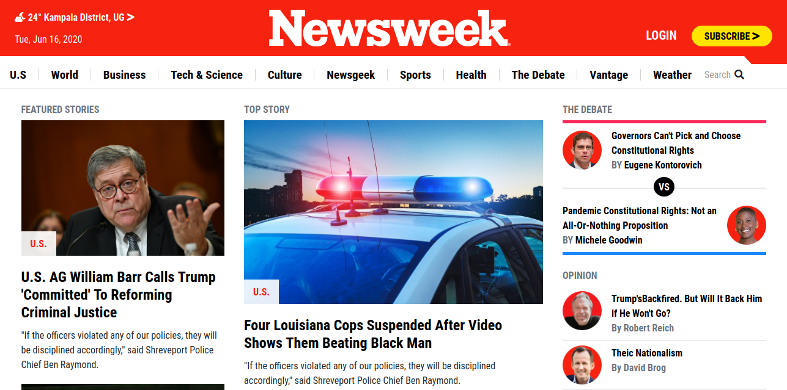

# Building with Responsive Design and CSS Frameworks

> This is a clone of the [Newsweek](https://www.newsweek.com/) webpage built with HTML and designed with CSS3 as well as a CSS Framework known as Bootstrap.

> In this project, the author demonstrates his understanding of Twitter Bootstrap as a CSS Framework which involves the use of predifined CSS styling properties on HTML elements by assigning classes associated with these styling properties to the various HTML elements.

> The project also demonstrates Bootstrap's Responsiveness concept of Mobile first approach by portraying the webpage's different responsive behaviours on various screens ranging from Mobile Screens to Desktop. 



This project covers the following Bootstrap concepts
- Bootstrap v4.5 Gridlayout System.
- Bootstrap v4.5 Float
- Bootstrap v4.5 Typography.
- Bootstrap's Responsive Design using classes such as (Col-sm, col-md, col-lg)

This project covers the following HTML and CSS3 concepts
- Meida Queries
- Flex and Grid

## Built With
- HTML
- CSS
- CSS Framework (Twitter Bootstrap)

## Live Demo

[Live Demo Link](https://rawcdn.githack.com/RNtaate/Newsweek-clone/ed6a79190211e7507e877ca29d501cb032d86511/index.html)


## Getting Started
To get a local copy of this repository, please run the following commands on your terminal

```
$ cd <folder>
```

```
$ git clone https://github.com/RNtaate/Newsweek-clone.git
```

## Authors

👤 **Roy Ntaate**

- Github: [@RNtaate](https://github.com/RNtaate)
- Twitter: [@RNtaate](https://twitter.com/RNtaate)
- Linkedin: [roy-ntaate](https://linkedin.com/in/roy-ntaate)


# 🤝 Contributing

Contributions, issues and feature requests are welcome!

Feel free to check the [issues page](https://github.com/RNtaate/Newsweek-clone/issues).

## Show your support

Give a ⭐️ if you like this project!

## Acknowledgments

- This project was originally taken from [The Odin project](https://www.theodinproject.com/courses/html5-and-css3/lessons/using-bootstrap)
- The project was inspired by the [Microverse](https://www.microverse.org/) program.

## 📝 License

This project is [MIT](lic.url) licensed.
